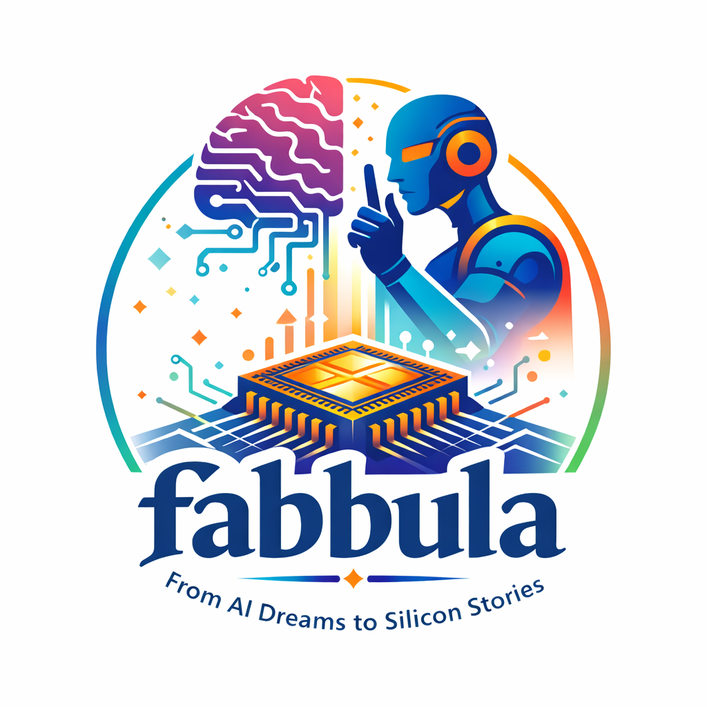

<div align="center">
<table><tr>
<td></td>
<td>

# fabbula

*A prompt was whispered, pixels took their form,*
*Through vectors traced and grids precisely worn,*
*The fab receives what neural minds compose --*
*In metal etched, a fabbula is born.*

</td>
</tr></table>

[](LICENSE)
[](https://www.rust-lang.org)
[](CONTRIBUTING.md)

[Getting Started](#getting-started) · [Examples](#examples) · [How It Works](#how-it-works) · [Supported PDKs](#supported-pdks) · [Performance](#performance) · [Prompt Guide](#prompt-guide) · [Roadmap](#roadmap)

</div>

---

## What is fabbula?

**fabbula** is a Rust toolchain that converts AI-generated images into DRC-clean GDSII layout data - ready to be fabricated as artwork on the top-metal layer of your chip.

The name comes from **fab** (as in semiconductor fabrication) + **fabula** (Latin for *story*, *tale*, *fable*). Every chip carries a story - of the team that designed it, the problem it solves, the late nights and breakthroughs. **fabbula** lets you etch that story into silicon, literally.

In the open-source chip community, there's a long tradition of hiding art on the die: logos, mascots, inside jokes, dedications. Until now, getting art onto your tapeout meant cobbling together Python scripts, ImageMagick, Inkscape, KLayout macros, and a lot of manual DRC cleanup. **fabbula** replaces all of that with a single Rust binary. One command. Zero external dependencies.

```
prompt → AI image → fabbula → GDSII → tapeout → your art lives in silicon forever
```

## Examples

| Input | SKY130 | IHP SG13G2 | GF180MCU |
|:-----:|:------:|:----------:|:--------:|
|  |  |  |  |
|  |  | | |
|  |  | | |

> [Interactive HTML previews](https://dkeller.github.io/fabbula/) with pan and zoom - powered by fabbula's built-in viewer.

## Why fabbula?

Existing image-to-GDSII tools are fragmented, single-PDK, and produce naive pixel-mapped rectangles that fail DRC. **fabbula** is different:

- **End-to-end pipeline** - PNG from ChatGPT/Gemini goes in, fab-ready GDSII comes out
- **Pure Rust** - built-in vectorizer (vtracer), SVG parser (usvg), GDSII writer (gds21). No Python, no Inkscape, no potrace, no ImageMagick. Just `cargo install fabbula`
- **Multi-PDK** - ships with SKY130, IHP SG13G2, and GF180MCU configurations. Add your own with a 30-line TOML file
- **DRC-clean by construction** - polygon sizing and grid snapping derived from actual PDK design rules
- **Blazing fast** - packed bitset bitmap, parallel DRC via rayon, streaming I/O. Processes a 2048x2048 image in ~12ms and validates 100k rectangles in ~15ms. See [Performance](#performance)
- **Vector-quality output** - traces curves into proper polygons, not just pixel rectangles. Your art looks like art, not a mosaic
- **Built-in DRC checker** - validates output before you waste a shuttle run

## Getting Started

```bash
# Install
cargo install fabbula

# Generate chip art from an AI-generated image
fabbula generate -i mascot.png -o mascot.gds -p sky130 --svg preview.svg

# See what your PDK expects
fabbula show-pdk ihp_sg13g2

# Merge artwork into your chip layout
fabbula merge -i mascot.png --chip my_chip.gds -o my_chip_art.gds -p gf180mcu

# Full pipeline: AI PNG → vectorize → GDSII in one shot
fabbula pipeline -i dalle_output.png -o art.gds -p sky130 \
    --size 200x200 \
    --vectorize polygon \
    --check-drc
```

## How It Works

**fabbula** operates as a four-stage pipeline, each stage implemented in pure Rust:

```
┌──────────────┐    ┌──────────────┐    ┌──────────────┐    ┌──────────────┐
│  AI Image    │───▶│  Vectorize   │───▶│  SVG → Poly  │───▶│  Poly → GDS  │
│  (PNG/JPEG)  │    │  (vtracer)   │    │  (usvg+lyon) │    │  (gds21)     │
└──────────────┘    └──────────────┘    └──────────────┘    └──────────────┘
     Input            Bitmap trace       Scale, snap to        Write GDSII
                      to clean SVG       mfg grid, DRC         on artwork
                      polygons           filter                layer
```

**Stage 1 - Threshold & Clean.** The input image is converted to a binary bitmap. Otsu's automatic thresholding handles varied AI outputs. Morphological operations remove speckles.

**Stage 2 - Vectorize.** The bitmap is traced into SVG polygon paths using vtracer - a Rust vectorizer that's O(n) and produces compact output without Bézier curves (in polygon mode). No external tools needed.

**Stage 3 - Scale & Snap.** SVG paths are scaled to physical chip dimensions, snapped to the PDK's manufacturing grid, and filtered against DRC rules (min width, min spacing, min area). This is where multi-PDK support matters - the same image produces correctly-sized polygons for each process.

**Stage 4 - GDSII Output.** Polygons are written as `GdsBoundary` elements on the correct top-metal layer via the gds21 crate. Supports both standalone GDS files and merging into existing chip layouts.

## Supported PDKs

| PDK | Process | Top Metal | GDS Layer | Min Width | Min Spacing |
|-----|---------|-----------|-----------|-----------|-------------|
| **SKY130** | SkyWater 130nm | met5 | 72/20 | 1.6 µm | 1.6 µm |
| **IHP SG13G2** | IHP 130nm BiCMOS | TopMetal2 | 134/0 | 1.8 µm | 1.8 µm |
| **GF180MCU** | GlobalFoundries 180nm | Metal5 | 81/0 | 0.44 µm | 0.46 µm |

Adding a new PDK takes about 30 lines of TOML:

```toml
[pdk]
name = "my_process"
node_nm = 65
db_units_per_um = 1000

[artwork_layer]
name = "met9"
gds_layer = 145
gds_datatype = 0

[drc]
min_width = 0.4
min_spacing = 0.4

[grid]
manufacturing_grid_um = 0.001
```

```bash
fabbula generate -i logo.png -o logo.gds -p my_process.toml
```

## Prompt Guide

The best chip art starts with the right AI prompt. Since top-metal artwork is monochrome (metal or no metal), you want images with hard black/white contrast and no gradients.

**Prompt template for ChatGPT / DALL-E:**

```
Create a black and white stencil design of [your subject].
Pure black shapes on white background, no gradients, no gray tones.
Style: linocut print / woodcut illustration.
Bold clean shapes suitable for metal etching.
Square format, 1024x1024.
```

**Styles that vectorize well:** linocut, woodcut, stencil art, silhouette, paper cutout, Japanese mon, heraldic crest, tribal art, art deco geometric, pixel art.

**Styles to avoid:** photorealistic, watercolor, pencil sketch, anything with gradients or soft edges.

See [`docs/PROMPT_GUIDE.md`](docs/PROMPT_GUIDE.md) for detailed templates and examples.

## Inspiration / Comparison

fabbula was born from a simple idea: reimplement image-to-GDSII artwork generation in Rust - as a single, self-contained binary with zero external dependencies. The chip art community has produced excellent work over the years, and fabbula builds on that foundation.

### Prior art

Several open-source tools tackle the image-to-GDSII problem. Each one contributed something valuable to the space:

- **[ArtistIC](https://github.com/pulp-platform/artistic)** (PULP Platform, 2025) - The most complete existing pipeline. Its tetromino-based polygon generation produces genuinely DRC-clean artwork by flowing shapes around existing top-metal structures. Also includes gigapixel-scale tiled rendering via KLayout and DEF-based annotation. Python, requires KLayout + ImageMagick + Potrace. IHP SG13G2 focused.
- **[logo-to-gds2](https://github.com/mattvenn/logo-to-gds2)** (Matt Venn, ~2020) - Converts PNG/SVG to GDS2 + LEF for top-metal artwork, built for the Zero to ASIC / SKY130 / OpenLane / Caravel ecosystem. Python + Magic VLSI. No automatic DRC compliance.
- **[chip_art](https://github.com/jazvw/chip_art)** (jazvw) - Maps grayscale pixel values to different metal layers (metals 1-4) for multi-layer artwork. Python + Magic VLSI + Docker. SKY130 focused.
- **[png2gds](https://github.com/ralight/png2gds)** (ralight) - Lightweight C tool mapping indexed-palette PNG colors to GDS layers. One square polygon per pixel. Designed to make adding logos to chip designs straightforward.
- **[svg2GDS](https://github.com/andestro/svg2GDS)** (andestro) - Converts SVG path objects directly to GDSII boundaries. Python.
- **[KLayout image-to-GDS scripts](https://www.klayout.de/)** - Ruby and Python macros by Matthias Koefferlein and others for converting images to GDS rectangles inside KLayout.

There are also several other converters ([gdsGEN](https://github.com/raghu1153/gdsGEN), [image2gds](https://github.com/raybrad/image2gds), [picture-to-gds](https://github.com/ourfool/picture-to-gds), [KLayout-PyMacros](https://github.com/zwh42/KLayout-PyMacros)) and a curated list of GDSII tools at [GDSII-Links](https://github.com/ashtanyuk/GDSII-Links).

### Where fabbula fits

All existing tools are Python or C, most require external dependencies (Magic VLSI, KLayout, ImageMagick, Docker), and none except ArtistIC address DRC compliance automatically. fabbula's contribution is bringing this to Rust: a single `cargo install`, no runtime dependencies, with DRC-clean output by construction via grid-snapped polygon sizing.

| | **fabbula** | ArtistIC | logo-to-gds2 | png2gds | chip_art |
|---|---|---|---|---|---|
| Language | Rust | Python | Python | C | Python |
| Self-contained | Yes | No (KLayout, IM, Potrace) | No (Magic VLSI) | Yes | No (Magic, Docker) |
| Multi-PDK | 3 built-in + custom TOML | IHP SG13G2 | SKY130 | Manual | SKY130 |
| DRC-clean output | By construction | Tetromino fill | Manual | No | No |
| Parallel DRC | Yes (rayon) | No | No | No | No |
| GDS merge | Yes | Yes (via KLayout) | No | No | No |
| Built-in DRC check | Yes | No | No | No | No |
| SVG preview | Yes | Yes (via KLayout) | No | No | No |

## Performance

fabbula is designed to be fast enough that artwork generation never becomes a bottleneck in your tapeout flow - even at large image sizes. All benchmarks run on a single machine using `cargo bench` (criterion).

### Polygon generation

Bitmap-to-rectangle conversion at ~80% metal density (matching typical PDK density targets):

| Image size | Pixels | Greedy merge | Row merge |
|---|---|---|---|
| 256 x 256 | 65k | 0.18 ms | - |
| 512 x 512 | 262k | 0.72 ms | 0.22 ms |
| 2048 x 2048 | 4.2M | 12.5 ms | 3.4 ms |
| 4096 x 4096 | 16.8M | 51 ms | - |

### DRC validation

Full DRC check (min width, max width, min spacing, wide-metal spacing, min area, density) on clean rect grids:

| Rectangles | Time |
|---|---|
| 12k | 1.6 ms |
| 50k | 6.8 ms |
| 100k | 15.2 ms |

### What makes it fast

- **Packed bitset bitmap** - `Vec<u64>` instead of `Vec<bool>` cuts memory 8x, and `count_ones()` makes density computation nearly free
- **Parallel DRC** - width/area and spacing checks run across cores via rayon, giving ~58% speedup on multi-core machines
- **R-tree spatial index** - spacing checks are O(n log n) instead of O(n^2), making 100k-rect layouts practical
- **Streaming I/O** - HTML/SVG previews write directly through a BufWriter instead of building multi-MB intermediate strings

## Roadmap

- [x] Multi-PDK configuration system
- [x] Bitmap → polygon generation with DRC-aware sizing
- [x] Three polygon merging strategies
- [x] GDSII read/write/merge
- [x] Built-in DRC validation
- [x] SVG preview output
- [ ] Built-in vtracer vectorization (PNG → SVG → GDS in one binary)
- [ ] usvg-based SVG path import (hand-drawn vector art)
- [x] Exclusion zones (avoid existing top-metal structures)
- [ ] Density-aware artwork generation
- [x] LEF output for OpenLane/OpenROAD integration
- [ ] Grayscale dithering for multi-density artwork
- [ ] OASIS output support
- [ ] WASM build for browser-based preview

## Contributing

Contributions are welcome. Whether it's a new PDK config, a bug fix, a better polygon merging algorithm, or prompt templates that produce great AI art - open a PR.

See [`CONTRIBUTING.md`](CONTRIBUTING.md) for guidelines.

## Acknowledgments

**fabbula** builds on excellent open-source work:

- [gds21 / Layout21](https://github.com/dan-fritchman/Layout21) - Rust GDSII library by Dan Fritchman
- [ArtistIC](https://github.com/pulp-platform/artistic) - PULP Platform's pioneering work on DRC-aware ASIC artwork tooling
- [logo-to-gds2](https://github.com/mattvenn/logo-to-gds2) - Matt Venn's original image-to-GDS tool for the Zero to ASIC community
- The open-source PDK community: [SkyWater](https://github.com/google/skywater-pdk), [IHP](https://github.com/IHP-GmbH/IHP-Open-PDK), [GlobalFoundries](https://github.com/google/gf180mcu-pdk)

## License

Apache-2.0

---

<div align="center">

*Every chip tells a story. Make yours visible.*

**[⭐ Star this repo](../../stargazers)** if you believe chip art deserves better tooling.

</div>
